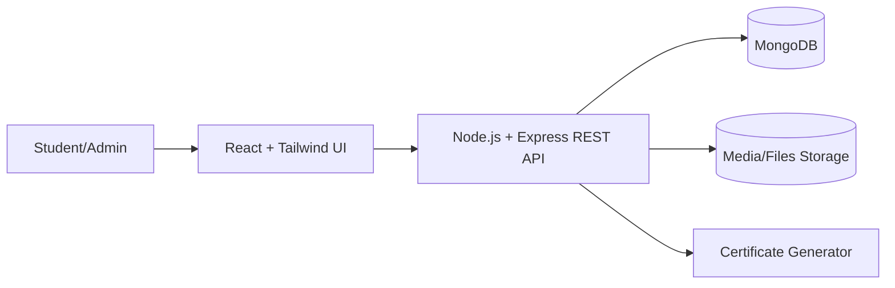
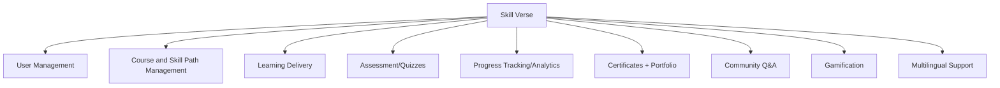

# Final Year Project Proposal

## Skill Verse: A Career-Focused E-Learning Platform

Submitted by: Rabim Kc  
Uni ID: 2414192  
Supervisor: Saroj D Shrestha  
Reader: Gunjan Kumar Mishra

---

## Abstract

Skill Verse is a career-focused e-learning web platform designed to reduce learner confusion and dropout by providing structured skill paths, interactive learning activities, and clear evidence of achievement. Unlike platforms that primarily offer isolated standalone courses, Skill Verse organizes content into guided roadmaps (Skill Paths), tracks progress across lessons and assessments, and generates verifiable outputs such as certificates and an auto-updating learner portfolio. The platform also supports bilingual learning (English and Nepali) and includes engagement features such as gamification and community Q&A to sustain motivation.

This project proposes the design and implementation of a full-stack web application using React and Tailwind CSS on the frontend, and Node.js/Express with MongoDB on the backend. The outcome is a working prototype demonstrating end-to-end flows: authentication, course enrollment, lesson consumption, quizzes, progress tracking, certification, portfolio generation, and basic community interaction.

Keywords: e-learning, skill paths, gamification, portfolio, progress tracking, bilingual learning

---

## 1. Introduction and Background

Online and blended learning continue to expand, but many e-learning environments struggle with learner completion, motivation, and a lack of structured progression. Learners often face a large catalog of unrelated courses without clear sequencing or guidance toward career outcomes. Additionally, in contexts like Nepal, English-only interfaces and content can limit accessibility for learners who prefer local language support.

Skill Verse addresses these challenges by offering structured learning roadmaps, progress visualization, and outputs that help learners demonstrate skills. It combines a guided learning experience with engagement mechanisms (gamification and community interaction) and employability-oriented artifacts (certificates and a shareable portfolio).

---

## 2. Problem Statement

Many e-learning platforms present three recurring problems:

1. Lack of structure and direction: learners receive catalogs of isolated courses without a clear progression toward a goal, which creates confusion and reduces completion.
2. Weak proof of skills: after completing courses, learners often receive only basic certificates that do not clearly communicate skill progression or portfolio-ready evidence.
3. Accessibility constraints: English-only interfaces can exclude learners who would benefit from bilingual (English and Nepali) learning support.

These issues affect students, job seekers, and professionals who need a structured path, sustained motivation, and credible outputs for the job market.

---

## 3. Aim and Objectives

### 3.1 Aim

Design and develop a career-focused e-learning platform that provides structured skill paths, supports bilingual learning, and generates learner portfolios to improve motivation, accessibility, and employability.

### 3.2 Objectives (SMART, testable)

1. Course and skill-path management: implement an admin system to create and organize courses into at least 3 skill paths, with clear sequencing and prerequisites.
2. Interactive learning and assessment: implement lessons and quizzes, with scoring and feedback, and show progress per course and skill path.
3. Certification and portfolio generation: generate a PDF certificate on completion and automatically record completed items into a shareable learner portfolio.
4. Engagement features: implement at least three gamification mechanics (XP, badges, streaks) and a community feature (Q&A) to increase participation.
5. Multilingual experience: implement English/Nepali language toggle and translate core UI and selected course content.

---

## 4. Proposed Solution and Novelty

Skill Verse provides a structured and career-focused learning experience through:

- Skill Paths: guided roadmaps that organize courses from beginner to advanced, helping learners understand what to do next.
- Dynamic portfolio: a continuously updated profile that records completed courses, skill paths, and certificates, enabling learners to demonstrate progress.
- Community Q&A: peer support to reduce friction during learning and improve persistence.
- Gamification: XP, badges, streaks, and leaderboards tied to meaningful learning milestones rather than superficial activity.
- Bilingual support: English and Nepali UI/content to improve accessibility for local learners.

---

## 5. Scope and Limitations

### 5.1 Scope (in-scope features)

- User authentication (student/admin roles)
- Admin course management (CRUD) and skill path structure
- Lessons: video, notes, and downloadable resources
- Quizzes and assessments with feedback
- Progress tracking dashboards and analytics visuals
- Certificate generation (PDF)
- Learner portfolio generation and sharing
- Gamification (XP, badges, streaks, leaderboard)
- Community forum (Q&A/discussion)
- Multilingual UI (English and Nepali)

### 5.2 Limitations (out-of-scope for phase 1)

- No dedicated mobile app (responsive web only)
- No live classes or video conferencing integration
- No advanced AI recommendation or automated grading in v1
- Limited or no payment gateway integration in v1
- Content authoring is supported, but original course production is not part of the project scope (demo content used for testing)

---

## 6. Methodology and Work Plan

### 6.1 Methodology

Agile Scrum is selected due to the project's modular feature set and the need for iterative development and feedback. Each sprint produces a working increment suitable for review and integration.

### 6.2 Sprint Plan (high level)

- Sprint 1 (2-3 weeks): authentication, roles, course browsing, basic admin course CRUD
- Sprint 2 (2-3 weeks): learning subsystem (lessons/resources) + quizzes
- Sprint 3 (2-3 weeks): progress tracking dashboards + certificates + portfolio
- Sprint 4 (2-3 weeks): community forum + gamification + multilingual support

Deliverables per sprint: working module, basic integration tests, and a short demo to supervisor/reader.

---

## 7. System Overview (Architecture and Modules)

### 7.1 High-Level Architecture

### 7.2 Functional Modules (Decomposition)

### 7.3 Module Summary (what each does)

- User Management: registration/login, roles, profile management, JWT-based sessions.
- Course Management: admin CRUD, categories, skill paths, course metadata and resources.
- Learning Delivery: lesson viewer, resource downloads, navigation per skill path.
- Assessment: quizzes, scoring, feedback, question bank management.
- Progress Tracking: completion percentage, quiz results, dashboards and charts.
- Certificates and Portfolio: PDF generation and portfolio updates on completion.
- Community: Q&A posts, replies, basic moderation controls.
- Gamification: XP, badges, streaks, leaderboard tied to learning milestones.
- Multilingual: language toggle and translated UI/content.

---

## 8. Tools and Technologies

- Frontend: React, Vite, Tailwind CSS, React Router, Axios, Chart.js
- Backend: Node.js, Express, JWT, bcrypt
- Database: MongoDB + Mongoose
- Certificates: PDF generation library (implementation choice to be finalized)
- Version control: Git and GitHub
- Prototyping: Figma
- Project management: Scrum board (Jira or GitHub Projects)

Note: keep the auth approach consistent in the final document (JWT-based auth in backend).

---

## 9. Risks and Mitigation

- Scope creep: prioritize sprint deliverables; treat optional features as stretch goals.
- Media handling complexity: start with hosted links or basic storage approach before full uploads.
- Community moderation: implement simple reporting and admin deletion, and rate limiting.
- Gamification backfiring: tie rewards to learning milestones and avoid "points for clicks".
- Multilingual quality: translate core UI first; course translation can be limited in v1.
- Security and privacy: hash passwords, validate inputs, use JWT expiry, and protect admin routes.

---

## 10. Evaluation Plan

The system will be evaluated via:

- Functional testing: end-to-end flows (register -> enroll -> complete lessons/quizzes -> certificate + portfolio update).
- Usability checks: small user walkthroughs (students) to identify navigation issues in skill paths.
- Engagement indicators (prototype-level): completion rate per skill path, average session actions, and streak continuity (as recorded by the system).
- Performance checks: page load and API latency for common operations (course list, dashboard).

---

## 11. References

Add your final citations here in the required style (APA/IEEE). Ensure every in-text citation in the literature review is listed with full bibliographic details.

---

## Appendix A: Work Breakdown Structure (WBS)

- User Management: registration/login, roles, profile
- Course Management: CRUD, categories, skill paths
- Learning Delivery: lessons, resources
- Assessment: quizzes, scoring, feedback
- Progress Tracking: progress + dashboard
- Certificates/Portfolio: PDF + portfolio
- Community: Q&A + moderation
- Gamification: XP/badges/streaks/leaderboard
- Multilingual: language toggle + translations

